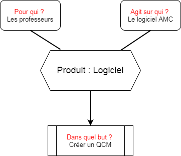
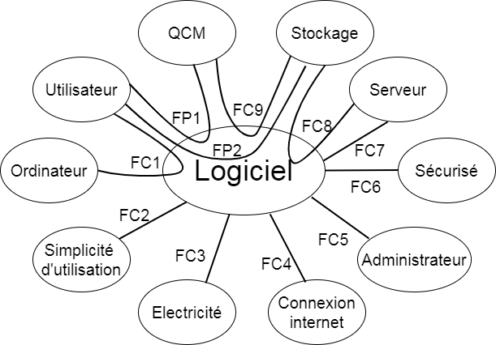

# Introduction

L'objectif de ce document est de rpésenter les besoins et demandes des clients dans le cadre de notre projet tutoré de seconde année à l'institue universitaire et technologie de Vélizy-Villacoublay. 

Ce document à été rédigé suite aux échanges avec clients monsieurs Barreau et monsieur Hoguin ainsi qu'à la suite d'une concertation au sein de l'équipe de développement. 

# Enoncé

## Problème à résoudre
L'objectif de ce projet est de réaliser une interface qui permettrait une utilisation simplifiée de l'application Auto Multiple Choice (ou AMC).

## Contexte du projet
AMC est un logiciel pouvant générer, corriger et annoter automatiquement des questionnaires à choix multiples. Le logiciel est complexe dans son fonctionnement pour des non initiés à l'informatique. Les clients souhaiteraient pouvoir utiliser ce logiciel de façon plus accessible.

## Objectifs du projet
L'objectif du projet est de créer une interface qui ferait le lien avec AMC et pouvant ainsi fournir une utilisation du logiciel plus facile. L'application à réaliser doit permettre d'effacer toutes les difficultés liés à AMC pour que plus de personnes puissent l'utiliser. De plus, un administrateur doit être présent afin de gérer ces utilisateurs et s'occuper des problèmes tels que les oublis de mot de passe, ou supprimer un utilisateur qui n'utilise plus l'application.

# Fonctions du produit 

## Fonction principale du logiciel

La fonction principale du produit est de générer un QCM sous le format du logiciel AMC. Celui-ci servira aux professeurs de l'IUT de vélizy

## Fonctions secondaire du logiciel

Le logiciel doit permettre aux utilisateurs de se connecter à un compte, de sauvegarder leurs QCM, ainsi que de de chercher, visualiser, modifier, éditer et supprimer des QCM précédemment créé. 
Le tout sera administrer par un utilisateur qui aura les droits de créer, modifier et supprimer des utilisateurs. Il pourra également surpprimer, visualiser et modifier les QCM des utilisateurs. 

# Contraintes 

## Contraintes de fonctionnement

Le produit sera utilisé par des professeurs de l’institut universitaire et technologique
de Vélizy-Villacoublay, sur un ordinateur disposant d’une connexion internet et d’un
moteur de recherche. 

## Contraintes de fonctionnement 

### Contraintes de fonctionnement

- il est nécessaire de disposer d'un serveurhébergeant le logiciel
- Un administrateur devra gérer la maintenance du logiciel
- Disposer d'une capacité de stockage de données sur le serveur
- Etre facile d'utilisation
- Un ordinateur et une connexion internet de la part de l'utilisateur.

### contraintes liées au milieu exterieur

- Les erreurs d'utilisateurs ne doivent pas impacter le logiciel.

### Contraintes de sécurité

- Resistant à une tentative de connexion non autorisé.

### Contraintes environnementale 

- Le serveur devra consommer un minimun d'energie possible pour son bon fonctionnement. 

## Contraintes de production 

- Savoir utiliser le logiciel Auto Multiple Choice (AMC) 
- disposer d'un serveur de test
- Des connaissance en programmation web, particulièrement en PHP, JavaScript, HTML, CSS ainsi qu'ne base de données. 
- il est préférable d'avoir de bonne compétences en design pour une meilleure experience utilisateur. 

# Analyses fonctionnelles 

Le produit à réaliser est un site internet permettant aux professeurs de l’institut
universitaire et technologique de Vélizy-Villacoublay de réaliser des QCM générer via
le logiciel AMC. Celui-ci devra être simple d’utilisation et permettre à toutes personnes
de pouvoir l’utiliser sans difficultés. L’utilisateur devra disposer d’un ordinateur et d’une
connexion internet afin d’utiliser le logiciel ainsi que d’un compte qui sera créer et gérer
par un administrateur

**Légende :**
FP : Fonction Principale
FC : Fonction de Contrainte

**fonction principale**
FP1 : l'utilisateur doit pouvoir créer un QCM

**Fonction secondaires**
FP2 : L'utilisateur doit accéder à son stockage. 

**Fonctions de contraintes de fonctionnement**
FC1 : L'utilisateur doit avoir un ordinateur 
FC4 : le logiciel a besoin d'un accès à internet pour fonctionner. 
FC5 : Un administrateur doit gérer la maintenance du logiciel.
FC7 : Le logiciel doit diposer d'un serveur 
FC8 : Le serveur doit avoir une capacité de stockage.
FC9 : Les QCM doivent être stocker sur le logiciel.  

**Fonctions de contraintes d'utilisation**
FC2 : Le logiciel doit être simple d'utilisation

**Fonctions de contraintes de sécurité**
FC6 : Le logiciel doit avoir un system de connexion sécurisée

**fonctions de contraintes environnementale**
FC3 : le logiciel doit consommer un minimun d'éléctricité 

