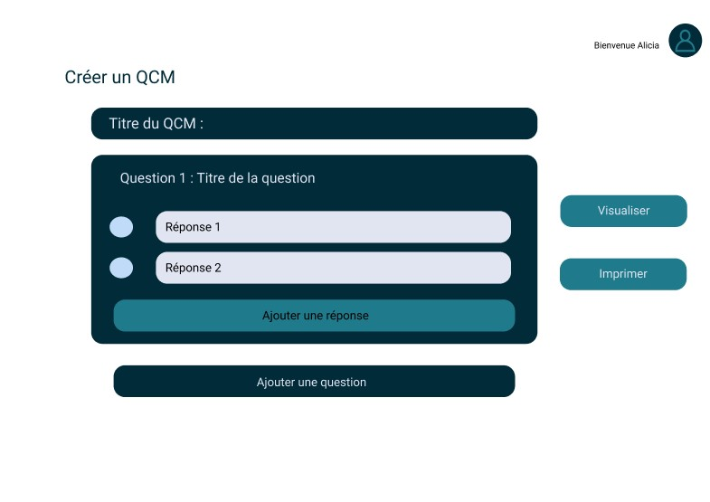
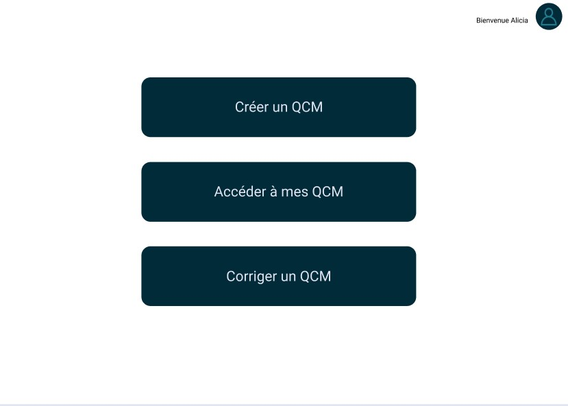
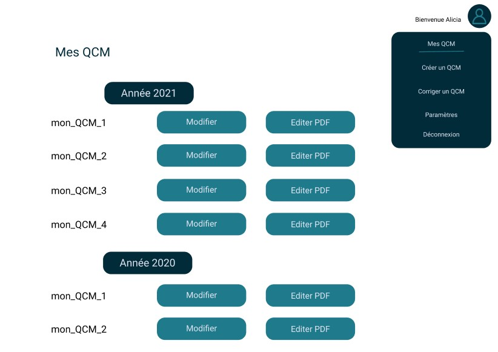
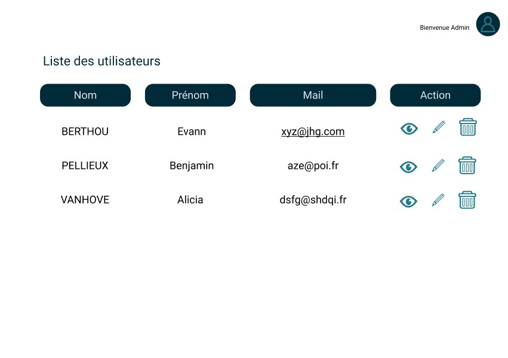
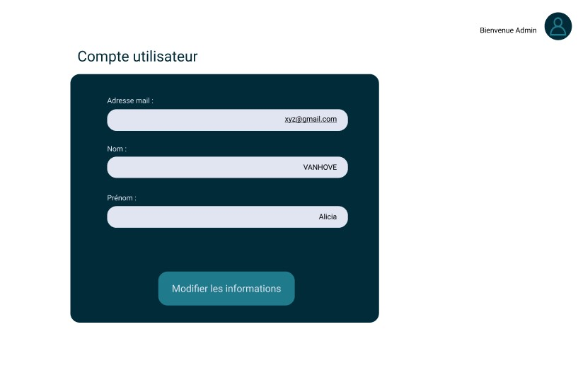
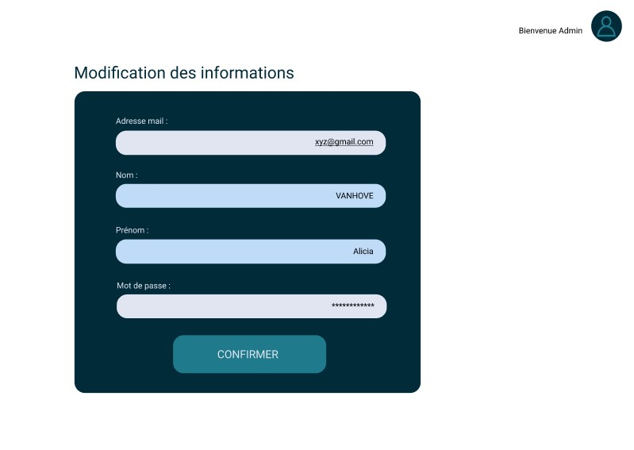
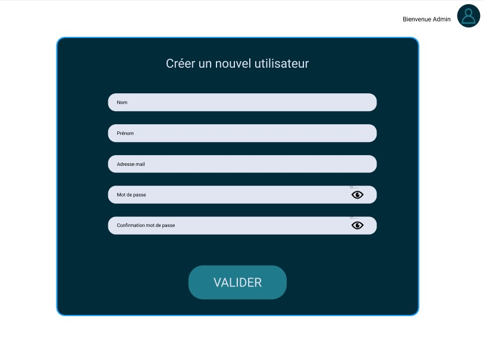
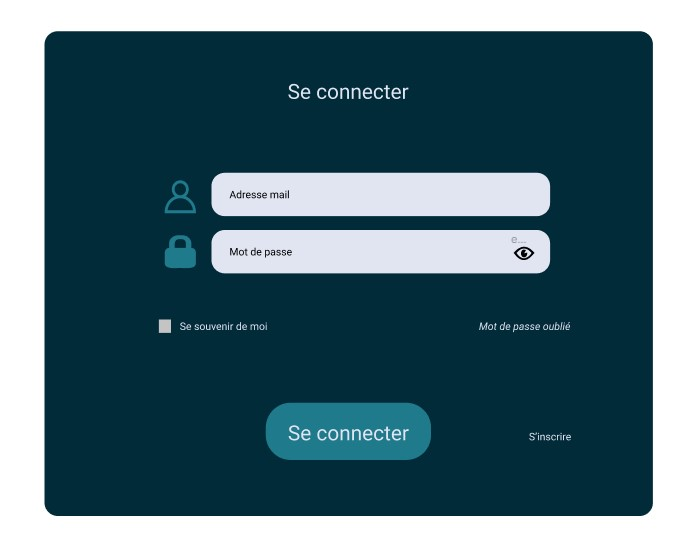

# Création d'un QCM

# Page d'acceuil des utilisateurs
 

# Affichage des QCM utilisateur

# Page administrateur

# Affichage information utilisateur

# Modification d'un compte par l'administrateur

i

# Creation utilisateur

# Se connecter

